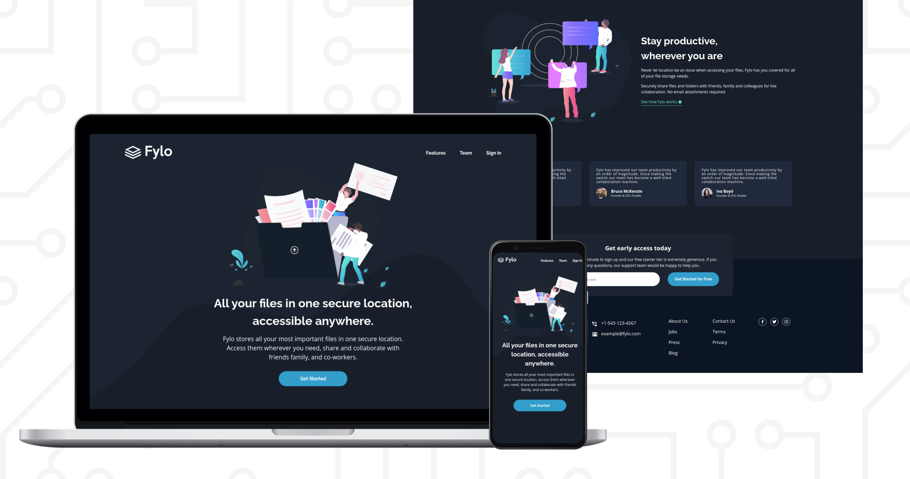

# Frontend Mentor - Fylo dark theme landing page solution

This is a solution to the [Fylo dark theme landing page challenge on Frontend Mentor](https://www.frontendmentor.io/challenges/fylo-dark-theme-landing-page-5ca5f2d21e82137ec91a50fd). Frontend Mentor challenges help you improve your coding skills by building realistic projects.

## Table of contents

- [Overview](#overview)
  - [The challenge](#the-challenge)
  - [Screenshot](#screenshot)
  - [Links](#links)
- [My process](#my-process)
  - [Built with](#built-with)
  - [What I learned](#what-i-learned)
  - [Useful resources](#useful-resources)
- [Author](#author)

## Overview

### The challenge

Users should be able to:

- View the optimal layout for the site depending on their device's screen size
- See hover states for all interactive elements on the page

### Screenshot

### Links

- Solution URL: [Github](https://github.com/satnaing/fylo-website)
- Live Site URL: [Fylo Live Website](https://fylosn.netlify.app/)

## My process

### Built with

- Semantic HTML5 markup
- CSS custom properties
- Flexbox
- CSS Grid
- Mobile-first workflow
- Sass

### What I learned

I've learned Sass before doing this project, but never tried once on a project before. In this project, I applied what I learned about Sass (variables, partials, mixins etc). I used Scss syntax in this project.

### Useful resources

- [Sass Doc](https://sass-lang.com/documentation) - Where I learned most about Sass and its features.
- [Sass File Structure](https://itnext.io/structuring-your-sass-projects-c8d41fa55ed4#:~:text=Simple%20Structure&text=scss%20.,buttons%2C%20navbars%2C%20cards%20etc.) - A good article about structuring Sass projects.

## Author

- Website - [Sat Naing](https://www.satnaing.dev)
- Frontend Mentor - [@satnaing](https://www.frontendmentor.io/profile/satnaing)
- Facebook - [@satnaing.dev](https://www.facebook.com/satnaing.dev)
